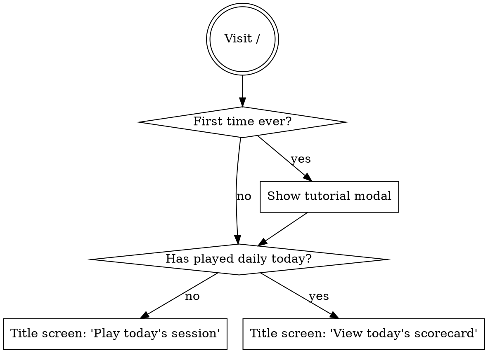

# Daily Play, Streaks, and Archive

## Goal

FlipWords currently picks 5 random puzzles per visit. That makes each play feel ephemeral — no anchor for streaks, no shared "today's puzzle" conversation, no reason to return tomorrow. This spec adds a daily-play model: everyone gets the same 5-puzzle session on a given calendar day, your streak builds when you finish them, the post-session scorecard becomes shareable, and past days remain playable in an archive for repeat fans.

## Decisions (locked from brainstorming)

| Question | Answer |
|---|---|
| What is a daily play? | The full 5-puzzle session (Tier 1 → 3), deterministic per date. |
| How are puzzles assembled? | Date → seeded RNG → reuse the existing tier-escalation picker. |
| When does the day roll over? | US Eastern midnight (single global rollover, NYT model). |
| What ticks the streak? | Completing all 5 puzzles today. Stars don't matter. |
| Missed day rule? | Streak resets to 0. Best streak is preserved separately. |
| Today after solving? | Free practice replays allowed, but stars/time freeze at first-run values. |
| Archive scope? | All past sessions, fully replayable, no streak impact. |
| Share string format? | Three lines: name + No., stars + time, URL. No streak, no emoji. |
| Entry point? | Dedicated title screen with today's card. |
| Day 1 / No. 1 | First deploy of the daily feature. Number = days since launch. |

## Scope

**In scope:**
- New title/landing screen at `/` with today's session card, streak stat, archive entry
- Deterministic daily picker (date → 5 puzzles, same for all players)
- localStorage-backed persistence for streak, per-session results, and "today played" lock
- Post-session scorecard updates: streak chip, Share button, countdown to next puzzle, practice-replay link
- Web Share API integration with clipboard fallback
- `/archive` route with month calendar of past sessions
- `/archive/$date` route for replaying a specific past session
- US Eastern day boundary using `Intl.DateTimeFormat`
- Backward-compatible: existing in-game UX (board, tiles, chin) is unchanged

**Out of scope:**
- Accounts, cloud sync, or cross-device streaks (localStorage only)
- Push notifications / reminder system
- Friend leaderboards or comments
- Per-puzzle (single-puzzle-of-the-day) variants
- Custom puzzle creation
- Stats analytics beyond what's already shown
- Theming changes (dark mode, etc.)

## Architecture

The feature is additive. The game internals (`FlipWords.tsx`, `transforms.ts`, `hint.ts`, `Tile.tsx`) keep their current shape. We add:

- A new state layer (`src/daily/`) for date math, daily picker, persistence, streak
- A title screen (`src/components/TitleScreen.tsx`) at the route root
- An archive view (`src/components/Archive.tsx`) at `/archive`
- New routes (`/archive`, `/archive/$date`) wired through TanStack Router

`FlipWords.tsx` keeps its session-running responsibility but takes its session source from a new prop (today's seeded session, an archived session, or a free-practice session) instead of hardcoding `pickSessionLevels()`.

### Module layout

```
src/
  daily/
    date.ts          — US Eastern day boundary helpers, day-number math, formatting
    schedule.ts      — date → seeded session (uses existing pickSessionLevels logic)
    storage.ts       — localStorage CRUD: streak, session results, today's lock
    streak.ts        — streak state machine: tick, reset, "best"
    share.ts         — formatShareString, share/copy entry point
    types.ts         — DailySessionResult, StreakState, etc.
  components/
    TitleScreen.tsx  — landing screen (was: straight to game)
    Archive.tsx      — month calendar + day detail
    Scorecard.tsx    — extracted from FlipWords.tsx, takes a SessionResult prop
    FlipWords.tsx    — accepts { mode: "daily" | "archive" | "practice", session, onComplete }
  routes/
    index.tsx        — TitleScreen
    play.tsx         — today's session (or scorecard if already done)
    archive.tsx      — Archive month view
    archive.$date.tsx— replay a specific date
```

### Date math (`src/daily/date.ts`)

The day boundary is US Eastern. Use `Intl.DateTimeFormat` with `timeZone: 'America/New_York'` so DST is handled automatically — no manual offset math.

```ts
// The "Eastern date" for a given moment, as YYYY-MM-DD.
function easternDateString(now: Date = new Date()): string;

// Day number from a Eastern date string. Returns 1 for LAUNCH_DATE.
function dayNumber(dateStr: string): number;

// ms until the next Eastern midnight from `now`.
function msUntilNextRollover(now: Date = new Date()): number;

// Eastern-date string for "yesterday", "tomorrow", etc.
function shiftDate(dateStr: string, days: number): string;
```

`LAUNCH_DATE` is a constant in `src/daily/date.ts` — set right before shipping (e.g., `"2026-05-19"` if we ship on May 18 Eastern).

The chin countdown on the title/scorecard reads from `msUntilNextRollover`. A 1Hz interval is fine (we already have one for the in-game timer pattern).

### Daily picker (`src/daily/schedule.ts`)

The current `pickSessionLevels` uses `Math.random()` for shuffles. We seed it instead.

```ts
function getSessionForDate(dateStr: string): Level[];
```

Implementation:
1. Hash the date string to a 32-bit seed (`xfnv1a` or similar 8-line hash).
2. Build a seeded mulberry32 RNG.
3. Reuse `pickSessionLevels`'s logic with a `pickOne` that takes the seeded RNG instead of `Math.random()`.

The tier curve (T1, T1, T2, T2-or-T3-flat, T3-rotated) is preserved exactly. Same library, same difficulty arc — just deterministic. Repeats can occur after the library exhausts; this is expected and noted (with 101 puzzles, the first repeat for any *specific puzzle* is statistical, not after a fixed N days).

We do **not** persist the schedule — it's pure-function and cheap to recompute. The admin route gets a "preview upcoming days" tab as a sanity check.

### Persistence (`src/daily/storage.ts`)

Single localStorage key: `flipwords_daily_v1`. Schema:

```ts
type Storage = {
  schemaVersion: 1;
  streak: {
    current: number;
    best: number;
    lastCompletedDate: string | null; // Eastern YYYY-MM-DD
  };
  sessions: {
    [easternDate: string]: {
      completedAt: number;            // epoch ms
      stars: 1 | 2 | 3;               // overall session rating
      perPuzzle: Array<{
        attempts: number;
        hints: number;
        durationMs: number;
        stars: 1 | 2 | 3;
      }>;
      totalDurationMs: number;
      isDailyResult: true;            // distinguishes from archive replays
    };
  };
  totals: {
    sessionsPlayed: number;           // distinct dates with a completed daily
    perfectSessions: number;          // 3-star daily completions
  };
};
```

The `sessions` map is keyed by Eastern date and only stores the **first** completion for that date. Practice replays do not overwrite. Archive replays are not persisted at all (the calendar reads back this same map — archive plays are purely transient).

We're explicitly not storing per-archive results because (a) it'd duplicate state with no UX benefit (we already show "you scored ★★☆ on May 7" from the original daily), (b) it sidesteps any "best in archive vs daily" stat confusion.

Read/write is straightforward. JSON parse on read, fallback to a fresh `Storage` if parse fails or schema mismatches. No migrations needed yet.

### Streak state machine (`src/daily/streak.ts`)

The streak is recomputed at session-complete time and on app load (to catch missed days when the user returns).

```ts
function recomputeStreak(storage: Storage, today: string): Storage["streak"];
function recordCompletion(storage: Storage, today: string, result: SessionResult): Storage;
```

Rules:

- **Completing today** (first time, after the full 5-puzzle session):
  - If `lastCompletedDate === today`: no change (replay).
  - If `lastCompletedDate === yesterday`: `current += 1`. Update `best = max(best, current)`.
  - Else: `current = 1`. Update `best = max(best, current)`.
- **On app load**, if `lastCompletedDate` is neither today nor yesterday: `current = 0`. (`best` is untouched.)

There's no "missing day grace" or "freeze" — that's a deliberate Wordle-pure decision.

### Routing

| Route | Purpose | Behavior |
|---|---|---|
| `/` | Title screen | Shows today's card, streak, stats. CTA → `/play`. If today already done, CTA reads "View today's scorecard" → still `/play`. |
| `/play` | Today's session | If today not done, runs the daily session. If done, shows the scorecard with Replay-as-practice option. |
| `/archive` | Month calendar | Browse past dailies. Months before `LAUNCH_DATE` are not navigable. Future months show empty cells. |
| `/archive/$date` | Replay archived session | Runs `FlipWords` in `mode: "archive"`. Scorecard at end shows the result but persists nothing. Back to `/archive`. |
| `/admin` | Existing puzzle library | Unchanged. Optionally gains a "preview daily schedule" tab. |

Today's URL is intentionally `/play`, not `/play/$today` — keeps share links short and stable, and avoids needing to canonicalize Eastern dates in routing.

### Share string (`src/daily/share.ts`)

Three-line format, ASCII-only:

```
FlipWords No. 042
★★☆ — 5:48
flipwords.superfun.games
```

- Line 1: `FlipWords No. {N}` where N is `dayNumber`.
- Line 2: `{stars}` = 3 chars, filled `★` + empty `☆` to total 3; `{time}` = `m:ss`.
- Line 3: bare site URL.

`shareSession(result, dayNumber)`:
1. Build the string.
2. If `navigator.share` exists, call it with `{ text }` (mobile native share sheet).
3. Else `navigator.clipboard.writeText(text)` + flash a toast "Copied".
4. Fail open — never throw at the UI layer.

### Practice replay (today)

After the user finishes today's daily, the scorecard adds a tertiary link: `Play again (practice — won't change score)`. Tapping it resets the in-memory session but does **not** clear the persisted result. The scorecard, when re-reached, still shows the original first-run stars/time. The countdown to next puzzle remains visible the whole time. No new localStorage writes.

## Visual design

The approved mockups live at `.superpowers/brainstorm/.../content/`:

- `title-screen-v2.html` — landing
- `outro-v3.html` (share string) + `outro.html` (scorecard layout)
- `archive-v2.html` — month calendar

Below is a tighter description of each.

### Title screen

Layout (top to bottom):

1. **Header row**: left = `menu` FAB (placeholder for future settings drawer), right = `help_outline` FAB (opens existing TutorialModal).
2. **Wordmark** (existing AnimatedWordmark), centered.
3. **Micro-label**: `DAILY WORD PUZZLE`.
4. **Hero card** (tile-face background, rounded 26px, `shadow-tile-lift`):
   - `MON · MAY 18` micro-label
   - Massive `No. 042` (~46px, `font-wide`)
   - `view_carousel` icon + `5 puzzles · Tier 1 → 3`
5. **Stat row** (3 cells, hairline dividers between):
   - **Streak**: warm-tinted circle, `local_fire_department` (filled), big number
   - **Avg ★**: gold-tinted circle, filled `star`, big number
   - **Played**: accent-soft circle, `grid_view`, big number
6. **Play button** (full-width, ink-on-paper, rounded-full): `Play today's session` + `arrow_forward`.
7. **Secondary row**: `history Archive` (single link, centered). The mockup's second link (`leaderboard Stats`) is deferred to V2 — leave it out of the V1 markup entirely rather than building a dead end.

Chin (existing chin component, unchanged style): `avg_pace` icon + countdown (`9h 37m`) on the left, `NEXT PUZZLE` label on the right.

**Conditional copy:**

- Streak = 0: stat shows `—` instead of a number, but the cell stays visible (no layout shift).
- Today already played: Play button changes to `View today's scorecard` + `chevron_right`. Stats row is unchanged. Tapping still routes to `/play`, which shows the scorecard instead of the game.
- First-time visitor (no history): tutorial modal pops on first load (existing behavior), then the title screen renders with all stats at 0/—.

### Scorecard

Builds on the existing session-complete sheet. Changes:

1. **Header micro-label** changes from `SESSION COMPLETE` to `SESSION COMPLETE · MON NO. 042`.
2. **Stars row** unchanged (existing zing-zing-pop animation kept).
3. **Streak chip (new)** — slotted between the headline and the existing stat grid:
   - Warm fire badge + label `STREAK` + big current value + small `+1 today` pill (only if streak just incremented this session)
   - Right side: `BEST` label + value
4. **Stat grid** (Time / Guesses / Hints) — unchanged.
5. **Per-puzzle breakdown** — unchanged.
6. **Primary CTA** changes from `Play another session` to **`Share result`** (`ios_share` icon, accent background).
7. **Secondary row**: `history Archive` left, countdown right (`avg_pace` + `New puzzle in 9h 37m`, dimmed).
8. **Tertiary line** (only when this is a daily session, not an archive): `refresh Play again (practice — won't change score)`.

Archive sessions show the same scorecard but: no streak chip, no countdown, no practice link. CTA is `Back to archive`.

### Archive

Month-grid calendar inside the same paper surface + teal chin shell.

- **Header**: `chevron_left` back FAB · centered title `Archive` · `tune` filter FAB (filter is V2 — no functionality yet, just present in the markup so the layout doesn't shift later).
- **Summary card** (single row, 3 equal hairline-divided cells): `Played` · `Perfect` · `Avg ★`.
- **Month nav**: `‹ May 2026 ›`. Months before launch don't have a previous arrow. Months entirely in the future aren't reachable.
- **7-day grid** with `S M T W T F S` header.
- **Cells** (5px radius — *not* chiclet-rounded):
  - `empty` — outside-of-month padding cells, no background
  - `played` — white tile-face background, mini stars below the date number
  - `three-star` — accent gradient background, mini stars (highlight perfects)
  - `missed` — dashed paper-line border, no stars, dim
  - `today` — accent ring (2px outline)
  - `future` — visible date number, dimmed, not interactive
- **Legend** at the bottom of the grid.
- **Chin**: `21 of 42 sessions · Tap a day`.
- **Day detail** (mobile: bottom sheet that slides up; desktop: side panel): date + No., headline (the winning headline that was rolled that day — pulled from stored `perPuzzle` or re-derived), big stars, Time / Guesses, big `Play this session` button, note that replays don't affect stats.

## State machine: what does `/` show?



## Edge cases

| Case | Behavior |
|---|---|
| User opens the app at 23:55 ET and finishes at 00:05 ET | Records completion against the **start** date. Implementation: snapshot `easternDateString()` at session start and use that as the persistence key. Avoids the "I solved it but it counted for tomorrow" frustration. The streak tick uses this start-date too, so it counts as completing "yesterday." If they then visit `/` they'll see today's (newly-available) session — they can play it too, and it'll tick the streak again (consecutive days). This is intentional: the edge case is rare and the alternative ("you can't play today's puzzle until tomorrow") feels broken. |
| Browser tab open across midnight | Same: the in-progress session uses its captured start-date. Title screen, if revisited, refreshes its `dayNumber` on route mount; the chin countdown ticks to "now" and naturally rolls. |
| Multi-tab — both running today's session | We don't try to lock. The first tab to complete wins for streak/persistence; the other tab just shows its own scorecard. The double-tab scenario is rare and self-correcting. |
| User clears localStorage mid-streak | Streak resets to 0 next load. Their archive of past dailies vanishes too. Documented behavior — this is the "no cloud sync" tradeoff. |
| User changes device timezone mid-session | `Intl.DateTimeFormat('America/New_York')` is timezone-agnostic on the input side, so date-string math stays stable. The chin countdown updates because it reads off the same source. |
| User shares the URL `flipwords.superfun.games` and a friend opens it 2 days later | Friend gets *their* today's puzzle, not the one the sharer played. This is fine — the share string identifies the puzzle by `No. {N}`, but linking to a specific past puzzle is out of scope (V2 could add `/archive/$date` deep links to share strings). |
| Friend without the app vs. with progress | Same code path. Storage is initialized fresh on first load. Streak starts at 0. |
| `navigator.share` unavailable on desktop browsers | Fall through to clipboard write + toast. |
| `navigator.clipboard` blocked (insecure context, permissions) | Show the share string in a modal with a "Copy this" textarea selected. |
| DST transition | Handled by `Intl.DateTimeFormat` — no special case needed. |

## Verification

- **Unit tests** for `date.ts`: `easternDateString` boundary cases (10:55pm vs 11:05pm ET on DST days), `dayNumber` math, `msUntilNextRollover`.
- **Unit tests** for `schedule.ts`: same date → same level set, different dates → different sets, all generated sessions still satisfy `isLevelSolved` (the existing dev audit can be repurposed).
- **Unit tests** for `streak.ts`: tick-from-zero, tick-from-yesterday, miss-resets, replay-no-op, "best" never decreases.
- **Unit tests** for `share.ts`: formatting for 1/2/3-star sessions and edge times (`0:01`, `99:59`).
- **Manual QA** checklist (added to a `docs/superpowers/qa/2026-05-18-daily.md`):
  - First-time visitor flow
  - Complete daily → streak goes 0 → 1
  - Complete two days in a row → 1 → 2
  - Skip a day → resets to 0; best preserved
  - Replay today as practice → scorecard frozen
  - Open archive, replay a past day → scorecard never persists
  - Share on iOS Safari → native sheet; macOS Safari → clipboard
  - Cross-midnight session (use system clock mock or shift `LAUNCH_DATE`)

## Open questions / V2

- Deep-link share strings to a specific past puzzle (`flipwords.superfun.games/no/42`).
- Per-archive stats (track best in archive vs daily; currently we don't).
- Statistics detail view (a `/stats` route with distribution charts, longest streak history, etc.) — the title-screen link to it is deferred along with the page itself.
- Reminder notifications (web push or a daily email signup).
- Streak protection token (Duolingo-style) — explicitly skipped per "Wordle-pure" decision but worth revisiting if churn is high.
